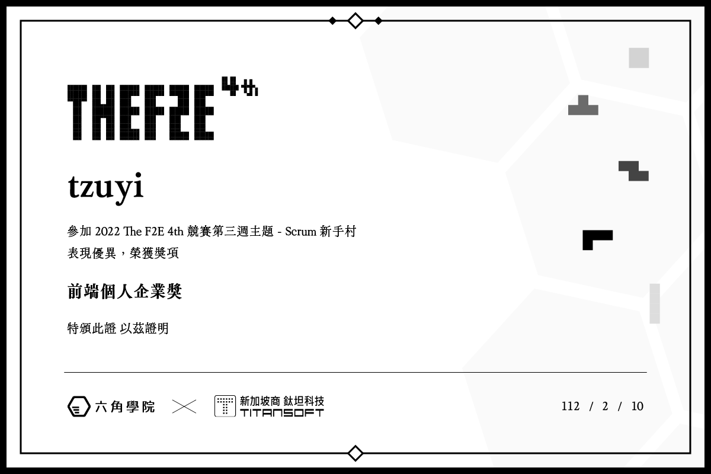

# Scrum Novice Village

## Description

This is a `Scrum Novice Village` website.

## Award Record

2022 THE F2E Week3 Front-End Individual Group Enterprise Award


## Development

Clone this repository and install dependencies by running `pnpm`(Node.js version is 16.13.2), then:

- `pnpm dev`: Run in development mode
- `pnpm build`: Build in production mode
- `pnpm preview`: Run preview

## Project Files

```text
src/
├── assets/
│   ├── loading.gif
│   ├── attached/*
│   ├── bg/*
│   ├── font/*
│   ├── icon/*
│   ├── logo/*
│   └── role/*
├── components/
│   ├── circuit/
│   │   ├── CircuitEe1.vue
│   │   ├── CircuitEe2.vue
│   │   ├── CircuitEe3.vue
│   │   ├── CircuitEe4.vue
│   │   ├── CircuitEe5.vue
│   │   ├── CircuitProcess.vue
│   │   └── CircuitSprint.vue
│   ├── final/
│   │   └── FinalDot.vue
│   ├── inventory/
│   │   ├── InventoryGg1.vue
│   │   └── InventoryGg2.vue
│   ├── plan/
│   │   ├── PlanEe1.vue
│   │   ├── PlanEe2.vue
│   │   ├── PlanEe3.vue
│   │   ├── PlanGg1.vue
│   │   ├── PlanPo1.vue
│   │   ├── PlanSm1.vue
│   │   └── PlanSm2.vue
│   ├── product/
│   │   ├── ProductList.vue
│   │   ├── ProductPo1.vue
│   │   ├── ProductPo2.vue
│   │   ├── ProductPo3.vue
│   │   ├── ProductPo4.vue
│   │   └── ProductPo5.vue
│   ├── retro/
│   │   ├── RetroGg1.vue
│   │   ├── RetroGg2.vue
│   │   └── RetroGg3.vue
│   ├── Draggable.vue
│   ├── ScrumBackground.vue
│   ├── ScrumFooter.vue
│   ├── ScrumLoading.vue
│   ├── ScrumPo.vue
│   ├── ScrumProgress.vue
│   ├── ScrumSm.vue
│   ├── ScrumTeam1.vue
│   └── ScrumTeam2.vue
└── hooks/
│   ├── useBackground.ts
│   ├── useDrag.ts
│   └── useRedirect.ts
└── pages/
│   ├── Circuit.vue
│   ├── Final.vue
│   ├── Index.vue
│   ├── Inventory.vue
│   ├── Plan.vue
│   ├── Product.vue
│   └── Retro.vue
└── router/
│   └── index.ts
└── store/
│   ├── flag.ts
│   ├── index.ts
│   └── process.ts
└── style/
│   ├── common/
|   │   ├── all.css
│   │   ├── background.css
│   │   ├── button.css
│   │   ├── dialog.css
│   │   ├── frame.css
│   │   ├── frosted.css
│   │   ├── list.css
│   │   ├── mask.css
│   │   ├── radio.css
│   │   ├── role.css
|   │   └── text.css   
│   ├── index.css
│   └── tailwind.css
└── types/
│   └── drag.d.ts
└── utils/
│   ├── checkType.ts
│   ├── common.ts
│   └── gsap.ts
├── App.vue
├── vite-env.d.ts
└── main.ts
```

## Use Technology

- vue3
- typescript
- tailwindcss
- vite
- pina
- vue-router
- gsap
